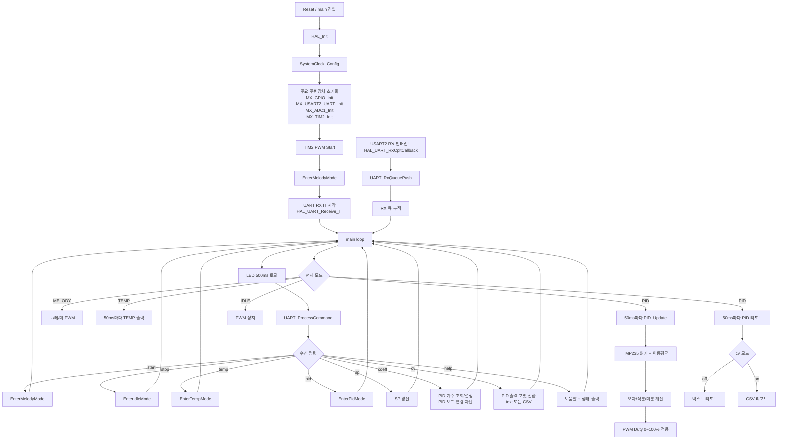

# 26-01-W11-TempPID-ADC

## 프로젝트 보고서

- 작성자: JeongWhan Lee
- 최초 작성일: 2025-04-08
- 최종 업데이트: 2026-05-17
- 대상 보드: STM32F411RE (NUCLEO-F411RE)

## 목차 (TOC)

- [1. 개요](#1-개요)
- [2. 개발 환경](#2-개발-환경)
- [3. 모듈별 설정](#3-모듈별-설정)
- [3.1 시스템 클럭 (RCC)](#31-시스템-클럭-rcc)
- [3.2 GPIO](#32-gpio)
- [3.3 USART2](#33-usart2)
- [3.4 ADC1](#34-adc1)
- [3.5 TIM2 PWM](#35-tim2-pwm)
- [3.6 인터럽트 및 수신 큐](#36-인터럽트-및-수신-큐)
- [4. 동작 모드](#4-동작-모드)
- [5. PID 파라미터 및 주요 상수](#5-pid-파라미터-및-주요-상수)
- [6. UART 명령 목록](#6-uart-명령-목록)
- [7. 전체 프로그램 플로우](#7-전체-프로그램-플로우)
- [8. 핵심 기능 코드 스니펫 및 설명](#8-핵심-기능-코드-스니펫-및-설명)
- [8.1 PID/TEMP 20Hz 전송 주기 통일](#81-pidtemp-20hz-전송-주기-통일)
- [8.2 coeff 명령: 계수 조회/설정 + PID 모드 변경 차단](#82-coeff-명령-계수-조회설정--pid-모드-변경-차단)
- [8.3 coeff all 명령으로 3개 계수 일괄 설정](#83-coeff-all-명령으로-3개-계수-일괄-설정)
- [8.4 cv=on/off 명령으로 PID 리포트 포맷 전환](#84-cvonoff-명령으로-pid-리포트-포맷-전환)
- [8.5 PID 리포트 출력 분기 (텍스트/CSV)](#85-pid-리포트-출력-분기-텍스트csv)
- [9. TMP235 온도 변환식](#9-tmp235-온도-변환식)
- [10. 시리얼 출력 형식 예시](#10-시리얼-출력-형식-예시)
- [11. 빌드 및 실행](#11-빌드-및-실행)
- [12. 핀 구성](#12-핀-구성)
- [13. 관련 소스 파일](#13-관련-소스-파일)

## 1. 개요

본 프로젝트는 STM32 HAL + CMake 기반에서 UART 명령 제어, PWM 출력, TMP235 온도 계측, PID 제어를 통합한 펌웨어임.

현재 시스템은 아래 4개 모드를 지원함.

- Idle
- Melody
- PID
- Temp

또한 PID 운용 편의를 위해 아래 기능이 추가됨.

- PID 계수 조회 및 개별/일괄 설정 명령
- PID 모드에서는 계수 변경 차단(안정성 목적)
- PID 리포트 출력 형식 전환(cv=off: 텍스트, cv=on: CSV)
- PID/TEMP 상태 전송 주기 20Hz(50ms) 통일

## 2. 개발 환경

| 항목 | 내용 |
|------|------|
| MCU | STM32F411RE (Cortex-M4, 84MHz) |
| 프레임워크 | STM32 HAL |
| 빌드 시스템 | CMake |
| 통신 인터페이스 | USART2, 115200 8N1 |
| PWM 출력 | TIM2 CH1 (PA15) |
| 온도 입력 | ADC1 IN6 (PA6) / TMP235 |
| 클럭 | HSI 16MHz -> PLL = 84MHz |

## 3. 모듈별 설정

### 3.1 시스템 클럭 (RCC)

- Oscillator: HSI ON
- PLL Source: HSI
- PLLM=16, PLLN=336, PLLP=4, PLLQ=4
- SYSCLK Source: PLLCLK
- AHB Prescaler: DIV1
- APB1 Prescaler: DIV2
- APB2 Prescaler: DIV1
- Flash Latency: 2

코드 스니펫:

```c
RCC_OscInitStruct.OscillatorType = RCC_OSCILLATORTYPE_HSI;
RCC_OscInitStruct.HSIState = RCC_HSI_ON;
RCC_OscInitStruct.PLL.PLLState = RCC_PLL_ON;
RCC_OscInitStruct.PLL.PLLSource = RCC_PLLSOURCE_HSI;
RCC_OscInitStruct.PLL.PLLM = 16;
RCC_OscInitStruct.PLL.PLLN = 336;
RCC_OscInitStruct.PLL.PLLP = RCC_PLLP_DIV4;
RCC_OscInitStruct.PLL.PLLQ = 4;

RCC_ClkInitStruct.SYSCLKSource = RCC_SYSCLKSOURCE_PLLCLK;
RCC_ClkInitStruct.AHBCLKDivider = RCC_SYSCLK_DIV1;
RCC_ClkInitStruct.APB1CLKDivider = RCC_HCLK_DIV2;
RCC_ClkInitStruct.APB2CLKDivider = RCC_HCLK_DIV1;
```

### 3.2 GPIO

- B1(PC13): GPIO_MODE_IT_FALLING, Pull 없음
- LD2(PA5): GPIO_MODE_OUTPUT_PP, 저속, Pull 없음
- TIM2_CH1(PA15): AF1 TIM2
- USART2 TX/RX(PA2/PA3): AF7 USART2
- ADC1 입력(주 사용 PA6): Analog mode

코드 스니펫:

```c
GPIO_InitStruct.Pin = B1_Pin;
GPIO_InitStruct.Mode = GPIO_MODE_IT_FALLING;
GPIO_InitStruct.Pull = GPIO_NOPULL;
HAL_GPIO_Init(B1_GPIO_Port, &GPIO_InitStruct);

GPIO_InitStruct.Pin = LD2_Pin;
GPIO_InitStruct.Mode = GPIO_MODE_OUTPUT_PP;
GPIO_InitStruct.Pull = GPIO_NOPULL;
GPIO_InitStruct.Speed = GPIO_SPEED_FREQ_LOW;
HAL_GPIO_Init(LD2_GPIO_Port, &GPIO_InitStruct);
```

### 3.3 USART2

- BaudRate: 115200
- WordLength: 8bit
- StopBits: 1
- Parity: None
- Mode: TX/RX
- HW Flow Control: None
- Oversampling: 16

코드 스니펫:

```c
huart2.Instance = USART2;
huart2.Init.BaudRate = 115200;
huart2.Init.WordLength = UART_WORDLENGTH_8B;
huart2.Init.StopBits = UART_STOPBITS_1;
huart2.Init.Parity = UART_PARITY_NONE;
huart2.Init.Mode = UART_MODE_TX_RX;
huart2.Init.HwFlowCtl = UART_HWCONTROL_NONE;
huart2.Init.OverSampling = UART_OVERSAMPLING_16;
```

### 3.4 ADC1

- Resolution: 12bit
- Clock Prescaler: PCLK/4
- ScanConvMode: Disable
- ContinuousConvMode: Disable
- External Trigger: Software Start
- Data Align: Right
- NbrOfConversion: 1
- EOCSelection: Single Conversion
- 채널: ADC_CHANNEL_6 (PA6)
- Sampling Time: 144 cycles

코드 스니펫:

```c
hadc1.Instance = ADC1;
hadc1.Init.ClockPrescaler = ADC_CLOCK_SYNC_PCLK_DIV4;
hadc1.Init.Resolution = ADC_RESOLUTION_12B;
hadc1.Init.ScanConvMode = DISABLE;
hadc1.Init.ContinuousConvMode = DISABLE;
hadc1.Init.ExternalTrigConv = ADC_SOFTWARE_START;
hadc1.Init.DataAlign = ADC_DATAALIGN_RIGHT;
hadc1.Init.NbrOfConversion = 1;

sConfig.Channel = ADC_CHANNEL_6;
sConfig.Rank = 1;
sConfig.SamplingTime = ADC_SAMPLETIME_144CYCLES;
```

### 3.5 TIM2 PWM

- Timer: TIM2 CH1
- Prescaler: 8400-1
- Counter Mode: Up
- Clock Division: DIV1
- PWM Mode: PWM1
- OC Polarity: High
- PWM 출력 핀: PA15
- 런타임에서 ARR/CCR를 조절해 주파수/듀티를 동적으로 변경

코드 스니펫:

```c
htim2.Instance = TIM2;
htim2.Init.Prescaler = 8400-1;
htim2.Init.CounterMode = TIM_COUNTERMODE_UP;
htim2.Init.Period = 4294967295;
htim2.Init.ClockDivision = TIM_CLOCKDIVISION_DIV1;

sConfigOC.OCMode = TIM_OCMODE_PWM1;
sConfigOC.Pulse = 0;
sConfigOC.OCPolarity = TIM_OCPOLARITY_HIGH;
sConfigOC.OCFastMode = TIM_OCFAST_DISABLE;
```

### 3.6 인터럽트 및 수신 큐

- USART2 IRQ Priority: (0, 0)
- UART RX 방식: 인터럽트 1바이트 수신 + 즉시 재등록
- RX Queue: 링버퍼(길이 64)
- Queue Overflow 카운터 유지

코드 스니펫:

```c
HAL_NVIC_SetPriority(USART2_IRQn, 0, 0);
HAL_NVIC_EnableIRQ(USART2_IRQn);

void HAL_UART_RxCpltCallback(UART_HandleTypeDef *huart)
{
    if (huart->Instance == USART2)
    {
        (void)UART_RxQueuePush(uart_rx_byte);
        (void)HAL_UART_Receive_IT(&huart2, &uart_rx_byte, 1U);
    }
}
```

## 4. 동작 모드

### 4.1 Idle 모드 (APP_MODE_IDLE)

- PWM 출력 정지
- stop 명령으로 진입

### 4.2 Melody 모드 (APP_MODE_MELODY)

- 262Hz -> 294Hz -> 330Hz 순환 재생
- 각 음 1000ms, 음 사이 100ms gap
- 부팅 기본 모드

### 4.3 PID 모드 (APP_MODE_PID)

- TMP235 온도 기반 PID 제어 수행
- 제어 주기: 50ms (20Hz)
- UART 리포트 주기: 50ms (20Hz)
- cv 설정에 따라 텍스트/CSV 형식 전송

### 4.4 Temp 모드 (APP_MODE_TEMP)

- 온도 모니터링 전용 모드
- UART 리포트 주기: 50ms (20Hz)

## 5. PID 파라미터 및 주요 상수

| 항목 | 현재값 |
|------|--------|
| Kp 기본값 | 8.0 |
| Ki 기본값 | 0.12 |
| Kd 기본값 | 1.2 |
| 기본 SP | 25.0 C |
| PID 제어 주기 | 50ms |
| PID/TEMP 리포트 주기 | 50ms |
| PID PWM 주파수 | 20Hz |
| ADC 이동평균 샘플 수 | 8 |
| UART 명령 버퍼 길이 | 64 bytes |

## 6. UART 명령 목록

| 명령 | 설명 |
|------|------|
| start | Melody 모드 진입 |
| stop | Idle 모드 진입 |
| temp | Temp 모드 진입 |
| pid | PID 모드 진입 |
| sp <tempC> | SP 변경 (0~100) |
| coeff | 현재 Kp/Ki/Kd 출력 |
| coeff kp <v> | Kp 설정 (0~1000) |
| coeff ki <v> | Ki 설정 (0~1000) |
| coeff kd <v> | Kd 설정 (0~1000) |
| coeff all <kp> <ki> <kd> | Kp/Ki/Kd 일괄 설정 |
| cv=off 또는 cv off | PID 리포트 텍스트 출력 |
| cv=on 또는 cv on | PID 리포트 CSV 출력 |
| help | 명령 도움말 + 상태 출력 |

주의:

- PID 모드(app_mode == APP_MODE_PID)에서는 coeff 변경 명령이 차단됨.
- coeff 조회는 모드와 관계없이 가능함.

## 7. 전체 프로그램 플로우

아래 다이어그램은 부팅 초기화, UART RX 인터럽트 큐잉, 메인 루프 명령 처리, 모드별 실행 경로를 한 번에 보여줌.



## 8. 핵심 기능 코드 스니펫 및 설명

### 8.1 PID/TEMP 20Hz 전송 주기 통일

아래 조건문으로 PID/TEMP 모두 PID_CONTROL_MS(50ms) 기준으로 전송함.

```c
if ((app_mode == APP_MODE_TEMP) && (HAL_GetTick() - temp_report_tick >= PID_CONTROL_MS))
{
    ...
}

if ((app_mode == APP_MODE_PID) && (HAL_GetTick() - pid_report_tick >= PID_CONTROL_MS))
{
    ...
}
```

설명:

- 리포트 주기를 상수(PID_CONTROL_MS)로 공유해 제어 주기와 로깅 주기의 동기화를 유지함.
- 샘플링/제어/시각화 타임베이스가 일치해 튜닝 시 해석이 쉬워짐.

### 8.2 coeff 명령: 계수 조회/설정 + PID 모드 변경 차단

아래 로직으로 coeff 파싱 후, PID 모드일 때 변경을 막음.

```c
if (has_value != 0U)
{
    if (app_mode == APP_MODE_PID)
    {
        printf("Cannot change coeff in PID mode. Change mode first (stop/start/temp).\r\n");
    }
    else if (coeff_is_all != 0U)
    {
        pid_kp = coeff_all_kp;
        pid_ki = coeff_all_ki;
        pid_kd = coeff_all_kd;
        pid_integral = 0.0f;
        pid_prev_error = 0.0f;
    }
    ...
}
```

설명:

- 운전 중 계수 급변으로 인한 출력 스파이크를 줄이기 위해 PID 모드 변경을 차단함.
- 계수 갱신 시 적분 상태와 이전 오차를 초기화하여 이전 제어 이력을 제거함.

### 8.3 coeff all 명령으로 3개 계수 일괄 설정

파서가 coeff all 토큰을 인식하면 3개의 float 토큰을 순서대로 읽음.

```c
else if ((name_len == 3) && (name_start[0] == 'a') && (name_start[1] == 'l') && (name_start[2] == 'l'))
{
    *is_all_out = 1U;
    *target_out = 0U;
}

...

if (*is_all_out != 0U)
{
    if (PID_ParseFloatToken(&p, all_kp_out) == 0U) return 0U;
    if (PID_ParseFloatToken(&p, all_ki_out) == 0U) return 0U;
    if (PID_ParseFloatToken(&p, all_kd_out) == 0U) return 0U;
    *has_value_out = 1U;
    return 1U;
}
```

설명:

- 단일 명령으로 3개 계수를 동시에 갱신할 수 있어 튜닝 반복 시간을 줄임.
- 입력 형식이 하나라도 틀리면 파싱 실패로 처리해 부분 갱신을 방지함.

### 8.4 cv=on/off 명령으로 PID 리포트 포맷 전환

cv 명령으로 pid_cv_csv_mode를 토글함.

```c
else if ((strcmp(p, "on") == 0) || (strcmp(p, "0n") == 0))
{
    pid_cv_csv_mode = 1U;
}
else if (strcmp(p, "off") == 0)
{
    pid_cv_csv_mode = 0U;
}
```

설명:

- cv=off: 사람이 읽기 쉬운 상태 문자열
- cv=on: 시리얼 플로터/외부 스크립트에서 파싱하기 쉬운 CSV
- 입력 실수를 고려해 0n도 on으로 허용

### 8.5 PID 리포트 출력 분기 (텍스트/CSV)

```c
if (pid_cv_csv_mode != 0U)
{
    printf("%u,%ld.%02ld,%ld.%01ld,%ld.%01ld\r\n", ...);
}
else
{
    printf("PID RAW=%u T=%ld.%02ldC SP=%ld.%01ldC OUT=%ld.%01ld%%\r\n", ...);
}
```

설명:

- 텍스트 모드: 디버깅과 수동 확인에 유리
- CSV 모드: 시간축 추세 확인과 도구 연동에 유리

## 9. TMP235 온도 변환식

TMP235 온도 계산식은 아래와 같음.

$$
V_{out} = \frac{ADC_{raw}}{4095} \times 3.3
$$

$$
T(^\circ C) = \frac{V_{out} - 0.5}{0.01}
$$

ADC 입력은 8샘플 이동평균으로 평활화함.

## 10. 시리얼 출력 형식 예시

### 10.1 TEMP 모드 (20Hz)

```text
TEMP RAW=1732 T=24.85C
```

### 10.2 PID 모드, cv=off (20Hz)

```text
PID RAW=1730 T=24.82C SP=30.0C OUT=41.5%
```

### 10.3 PID 모드, cv=on (20Hz)

```text
1730,24.82,30.0,41.5
```

CSV 필드 순서:

- 1열: ADC RAW
- 2열: 현재 온도 T
- 3열: 설정온도 SP
- 4열: 출력 OUT(% PWM)

## 11. 빌드 및 실행

### 11.1 빌드

```bash
cd build/Debug
cmake --build .
```

### 11.2 시리얼 설정

| 항목 | 값 |
|------|----|
| Baud rate | 115200 |
| Data bits | 8 |
| Parity | None |
| Stop bits | 1 |
| Flow control | None |

### 11.3 테스트 명령 시퀀스 예시

```text
temp
pid
cv=off
cv=on
stop
coeff all 9.0 0.20 1.40
pid
```

## 12. 핀 구성

| 핀 | 기능 | 비고 |
|----|------|------|
| PC13 | 사용자 버튼 입력 | EXTI Falling Edge |
| PA5 | LD2 LED 출력 | 500ms 토글 |
| PA2 | USART2_TX | AF7 |
| PA3 | USART2_RX | AF7, NVIC IRQ 사용 |
| PA15 | TIM2_CH1 PWM 출력 | 부저/히터 제어 |
| PA6 | ADC1_IN6 | TMP235 입력 |

## 13. 관련 소스 파일

| 파일 | 설명 |
|------|------|
| Core/Src/main.c | 모드 전환, 명령 파서, PID 제어, UART 출력 |
| Core/Src/stm32f4xx_hal_msp.c | UART/ADC/TIM MSP 초기화 |
| Core/Src/stm32f4xx_it.c | 인터럽트 핸들러 |
| 26-01-W11-TempPID-ADC.ioc | CubeMX 설정 |

