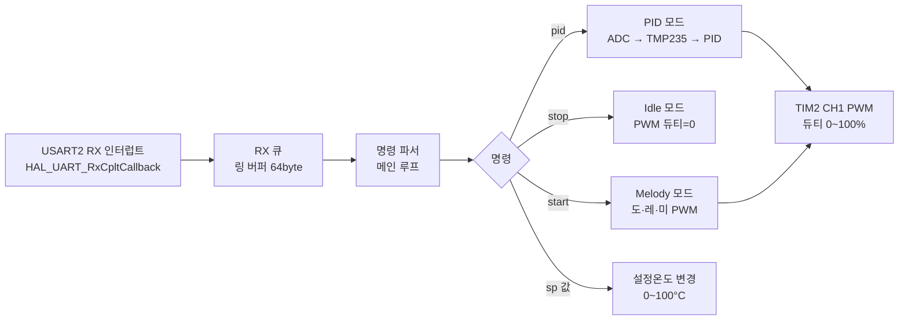

# 26-01-W11-TempPID-ADC

## 프로젝트 보고서

- 작성자: JeongWhan Lee
- 작성일: 2025-04-08
- 대상 보드: STM32F411RE (NUCLEO-F411RE)

## 1. 개요

본 프로젝트는 STM32 HAL과 CMake 기반 개발 환경에서 USART2 명령 제어, TIM2 PWM 부저 출력, TMP235 온도 센서 기반 PID 온도 제어를 통합한 펌웨어를 구현함. 

시스템은 세 가지 동작 모드(Idle, Melody, PID)를 지원하며, PC 시리얼 터미널로 수신하는 명령에 따라 모드를 전환함.

## 2. 개발 환경

| 항목 | 내용 |
|------|------|
| MCU | STM32F411RE (Cortex-M4, 84MHz) |
| 프레임워크 | STM32 HAL |
| 빌드 시스템 | CMake |
| 통신 인터페이스 | USART2, 115200 8N1 |
| PWM 출력 | TIM2 CH1 (PA15) |
| 온도 입력 | ADC1 IN6 (PA6) / TMP235 |
| 클럭 | HSI 16MHz → PLL × 336/16/4 = 84MHz |

## 3. 동작 모드

### 3.1 Idle 모드 (`APP_MODE_IDLE`)
- 부저 출력 정지, PID 제어 중단
- `stop` 명령 수신 시 진입

### 3.2 Melody 모드 (`APP_MODE_MELODY`)
- TIM2 CH1 PWM으로 도(262Hz)→레(294Hz)→미(330Hz) 순환 재생
- 각 음 지속시간 1,000ms, 음 간 간격 100ms
- 부팅 시 기본 모드로 진입
- `start` 명령으로 재진입 가능

### 3.3 PID 온도 제어 모드 (`APP_MODE_PID`)
- TMP235 온도 센서 ADC 값을 읽어 PID 제어 수행
- TIM2 CH1 PWM 듀티비로 히터 출력 조절 (PWM 주파수: 20Hz)
- PID 제어 주기: 50ms
- 1,000ms마다 온도·ADC·출력 상태를 UART로 보고
- `pid` 명령으로 진입

## 4. PID 제어 파라미터

| 파라미터 | 값 |
|----------|----|
| Kp | 4.0 |
| Ki | 0.12 |
| Kd | 1.2 |
| 기본 설정온도(SP) | 25.0 °C |
| 제어 주기 | 50ms |
| PWM 주파수 | 20Hz |
| ADC 이동평균 샘플 수 | 8 |

## 5. UART 명령 목록

| 명령 | 동작 |
|------|------|
| `start` | Melody 모드 진입 (멜로디 재생 시작) |
| `stop` | Idle 모드 진입 (모든 출력 정지) |
| `pid` | PID 온도 제어 모드 진입 |
| `sp <값>` | PID 설정온도 변경 (0.0 ~ 100.0 °C) |

## 6. 시스템 동작 흐름



## 7. TMP235 온도 변환

TMP235 센서의 출력 전압을 온도로 변환하는 식은 다음과 같음.

$$
V_{out} = \frac{ADC_{raw}}{4095} \times 3.3\ \text{V}
$$

$$
T\ (°C) = \frac{V_{out} - 0.5}{0.01}
$$

ADC 노이즈 감소를 위해 8샘플 이동평균 필터를 적용.

## 8. 핀 구성

| 핀 | 기능 | 비고 |
|----|------|------|
| PC13 | 사용자 버튼 입력 | EXTI Falling Edge |
| PA5 | LD2 LED 출력 | 500ms 토글 |
| PA2 | USART2_TX | AF7 |
| PA3 | USART2_RX | AF7, NVIC 인터럽트 Priority 0 |
| PA15 | TIM2_CH1 PWM 출력 | 부저/히터, Prescaler=8400-1 |
| PA6 | ADC1_IN6 | TMP235 온도 센서, 144 cycles 샘플링 |
| PA13, PA14, PB3 | SWD/SWO | 디버그 핀 |

## 9. 빌드 및 실행 방법

### 빌드

```bash
cd build/Debug
cmake --build .
```

### 시리얼 터미널 설정

| 항목 | 값 |
|------|----|
| Baud rate | 115200 |
| Data bits | 8 |
| Parity | None |
| Stop bits | 1 |
| Flow control | None |

### 명령 예시

```
start          → 멜로디 재생 시작
stop           → 출력 정지
pid            → PID 온도 제어 시작 (SP=25.0°C)
sp 30.5        → 설정온도를 30.5°C로 변경
```

## 10. 검증 정리

- UART 인터럽트 경로(NVIC + `USART2_IRQHandler` + 콜백 재등록) 적용 후 명령 수신 정상 동작 확인
- Melody / Idle 모드 전환(`start`/`stop`) 정상 동작 확인
- PID 모드 진입 후 온도 피드백 제어 및 UART 보고 정상 확인
- `sp` 명령으로 런타임 중 설정온도 변경 정상 확인
- 최신 빌드 성공 (FLASH: 25,372B, RAM: 2,408B)

## 11. 관련 소스 파일

| 파일 | 설명 |
|------|------|
| Core/Src/main.c | 메인 펌웨어 로직 전체 |
| Core/Src/stm32f4xx_hal_msp.c | USART2 NVIC 설정 포함 |
| Core/Src/stm32f4xx_it.c | `USART2_IRQHandler` 추가 |
| 26-01-W11-TempPID-ADC.ioc | STM32CubeMX 구성 파일 |

